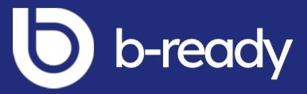
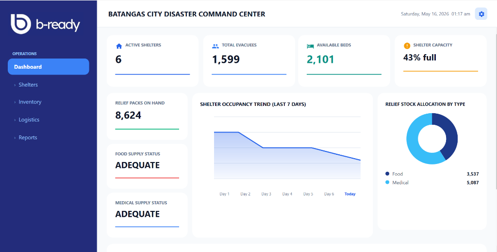
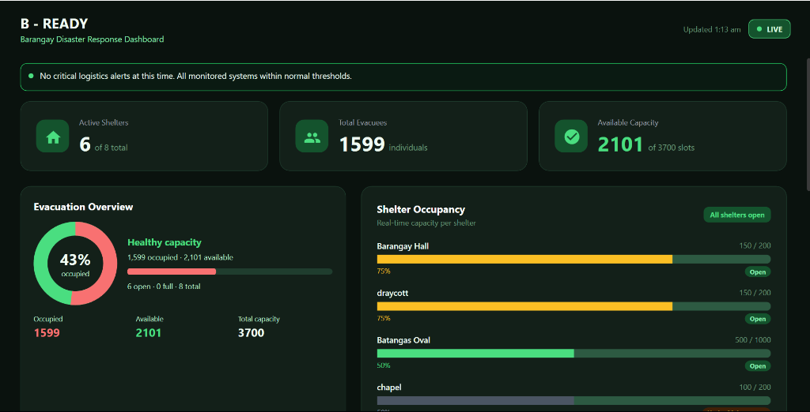
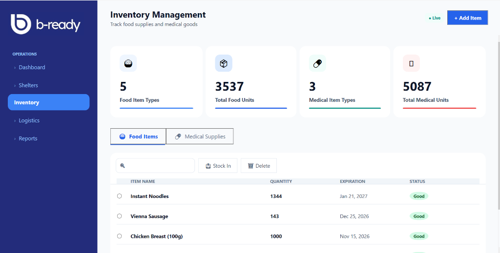
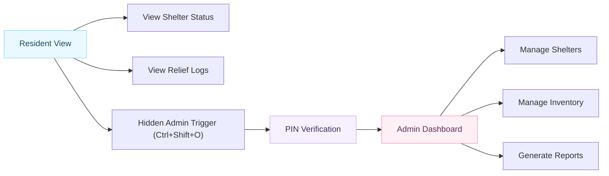
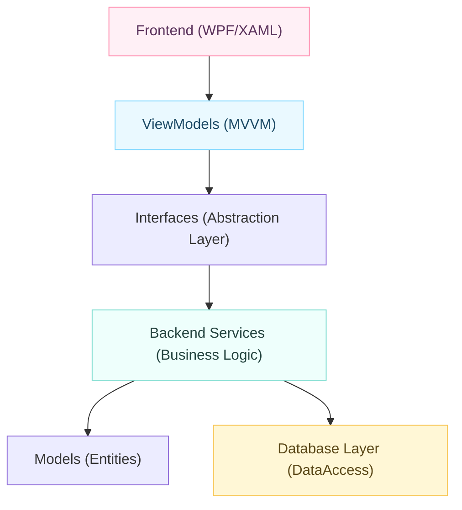

<a id="top"></a>

<div align="center">
  

  <h1>Project B-Ready</h1>

  <p>
    <strong>A professional digital disaster relief and shelter management system designed for real-time barangay emergency response.</strong>
  </p>

  <p>
    <a href="#instructions-on-how-to-run-the-application"></a>
    <a href="#quality"></a>
    <a href="LICENSE"></a>
    <a href="#"></a>
  </p>

  <p>
    <a href="#demo">Demo</a> •
    <a href="#instructions-on-how-to-run-the-application">Run</a> •
    <a href="#features-and-functionalities-of-the-system">Features</a> •
    <a href="#uml-diagram">UML</a> •
    <a href="#developers">Developers</a> •
    <a href="#quality">Quality</a>
  </p>
</div>

---
## Demo

<div align="center">
  
</div>

| Admin Dashboard | Resident Kiosk | Inventory Management |
| --- | --- | --- |
|  |  |  |

## Instructions on How to Run the Application

### Requirements

- **Windows 10/11**
- **Visual Studio 2022** (with `.NET desktop development` workload)
- **.NET 8.0 SDK**
- **Git**
- **PostgreSQL Instance** (or access to the project's Supabase instance)

### Install From Source

```bash
git clone https://github.com/Koe-byte/Project_BReady.git
cd Project_BReady
dotnet restore
dotnet build
```

### Run From Visual Studio

1. Open `ProjectBReadyWPF.sln`.
2. Rename `appsettings.Example.json` to `appsettings.json`.
3. Update the connection string with valid PostgreSQL credentials.
4. Set `ProjectBReadyWPF` as the startup project.
5. Press `F5`.

## Quick Start

Copy and run this from your terminal:

```bash
# Clone and enter the directory
git clone https://github.com/Koe-byte/Project_BReady.git; cd Project_BReady

# Restore and run
dotnet run --project ProjectBReadyWPF.csproj
```

> [!TIP]
> **Admin Access:** Once the app is running in Resident Mode, press `Ctrl + Shift + O` and enter the secure PIN to access Admin Features.

## Project Description and Purpose

**Project B-Ready** is born from the need to modernize disaster response at the grassroots level. Traditionally, barangay officials rely on manual logbooks to track evacuees and relief goods, leading to data delays and inaccuracies during critical hours.

Our system digitizes this workflow, providing:
- **Real-time transparency:** Residents see which shelters are open or full immediately.
- **Resource Accountability:** Every item in the inventory is tracked from stock-in to dispatch.
- **Dual-Layer Security:** Public-facing kiosks keep data safe while allowing access to authorized personnel via hidden shortcuts and PINs.

## The Four Pillars of OOP in B-Ready

This project was built to demonstrate industry-standard Object-Oriented Programming principles.

### 1. Encapsulation
Data is protected within models like `Shelter.cs`. We use properties with logic validation to ensure the system state remains consistent.
```csharp
public void UpdateOccupancy(int count) {
    if (CurrentOccupancy + count <= MaxCapacity) {
        CurrentOccupancy += count;
        UpdateStatus();
    } else {
        throw new Exception("Shelter is at full capacity!");
    }
}
```

### 2. Inheritance
We use a hierarchical user model. `BarangayOfficial` and `Resident` both inherit from a base `Person` class, sharing core attributes while extending specific functionality.

### 3. Polymorphism
Service interfaces like `IShelterService` allow for different implementations (e.g., a Mock service for testing vs. a Database service for production) without changing the UI logic.

### 4. Abstraction
Complexity is hidden behind clean interfaces. The UI doesn't know *how* the data is saved; it just interacts with the abstract service layer.

## Features and Functionalities of the System

| Area | What It Does |
| --- | --- |
| **Shelter Monitoring** | Real-time tracking of occupancy, capacity, and operational status (Open, Full, Closed). |
| **Inventory System** | Manage relief goods with stock-in/stock-out logging and trend tracking. |
| **Kiosk Mode** | A read-only informational display for residents in evacuation centers. |
| **Admin Panel** | Hidden management suite accessible via `Ctrl + Shift + O`. |
| **Real-time Sync** | Automatic updates across all connected terminals when data changes in the database. |
| **Secure PIN** | Secondary authentication layer for administrative actions. |
| **Data Persistence** | Robust PostgreSQL backend ensures data is never lost, even after a restart. |

## Explanation of How the Program Works

The application starts in **Resident View**, functioning as an information kiosk. The system establishes a connection to the PostgreSQL database and listens for real-time notifications. When an official updates a shelter's status on one computer, all other kiosks update instantly.



## Tech Stack

| Layer | Technology |
| --- | --- |
| **Language** | C# 12 |
| **Runtime** | .NET 8.0 |
| **UI Framework** | WPF (Windows Presentation Foundation) |
| **Database** | PostgreSQL / Supabase |
| **Arch Pattern** | N-Tier / MVVM |
| **Dependency Injection** | Microsoft.Extensions.DependencyInjection |

## Architecture

We follow a strict **N-Tier Architecture** to separate concerns and improve maintainability.



## Project Structure

```text
ProjectBReadyWPF/
|-- Backend/              Core Business Logic
|   |-- Interfaces/       Service Contracts
|   |-- Models/           Data Entities (Shelter, Person, etc.)
|   `-- Services/         Logic Implementation
|-- Database/             Data Access Layer
|   `-- DataAccess/       PostgreSQL Helper Classes
|-- docs/                 Project Documentation & Media
|   |-- brand/            Banners and Social Preview
|   |-- demo/             Application Demo Assets
|   `-- screenshots/      Feature Screenshots
|-- Frontend/             User Interface
|   |-- Assets/           Logos, Styles, and Themes
|   |-- ViewModels/       UI State Management
|   `-- Views/            XAML Screens (Resident, Admin)
|-- App.xaml              Application Entry Point
`-- ProjectBReadyWPF.sln  Main Solution File
```

## Developers

- **John Danver Manalo** - Project Manager
- **Tristan Allen Cabral** - Logic Developer / Tester
- **Nash Ibon** - Logic Developer / Tester
- **Janna Alexis Raras** - Lead GUI Designer / UX Specialist

## Contributing

1. Fork the Project.
2. Create your Feature Branch (`git checkout -b feature/AmazingFeature`).
3. Commit your Changes (`git commit -m 'Add some AmazingFeature'`).
4. Push to the Branch (`git push origin feature/AmazingFeature`).
5. Open a Pull Request.

## License

Distributed under the MIT License. See `LICENSE` for more information.

<div align="center">
  <sub>Built for the community, by the community. Stay safe, stay B-Ready.</sub>
  <br />
  <a href="#top">Back to top</a>
</div>
